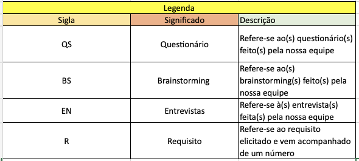

# 
 Backlog do Produto
 

### Histórico de versão
|Data | Versão | Descrição | Autor(es)
| -- | -- | -- | -- |
| 19.02.2021 | 0.1 | Criação do documento |Damarcones, Erick, Lucas |
| 03.03.2021 | 0.1 | Revisão do documento |Isabella |
| 06.03.2021 | 1.0 | Revisão e reestruturação do documento |Erick|
| 06.03.2021 | 2.0 | Documenta a versão 2.0 do backlog |Erick|

### Participantes
 
* Damarcones Porto
* Erick Giffoni
* Lucas Lopes
* Isabella Carneiro (Revisão)

 

### Introdução

 Este documento visa fornecer uma visão geral de todos os requisitos que deverão ser entregues 
a cada iteração com o cliente, juntamente com suas prioridades previamente elicitadas. 

 O Backlog do produto pode sofrer alterações ao longo do projeto, em sua quantidade de 
requisitos ou prioridades, dependendo das necessidades que surgirem ao longo do desenvolvimento.

<em>Guia PMBOK®</em>

### Metodologia

Para a realização desse documento, em um primeiro momento os participantes decidiram 
qual ferramenta utilizariam para elaborá-lo. A escolha foi utilizar o Microsoft Excel. 
Em seguida ocorreu a colaboração em conjunto, de modo online, para construir o backlog.

Em um segundo momento, partimos para ajustes finos e para refatoração do backlog. 
Como resultado chegamos a uma versão melhor elaborada do backlog - a versão 2.0.
### Resultados

A versão 2.0 do backlog está mais completa e também trás consigo revisões e reestruturações 
feitas pela equipe. Como diferenciais da primeira versão, agora o backlog traz as 
colunas de **Épico** e **Rastro**, além de uma melhor organização dos requisitos 
em relação às **features** e revisões quanto à priorização. 
  
Sobre nossos **Épicos**: escolhemos nomes criativos para abordar esse nível de granularidade. 
A escolha dos nomes procurou homenagear alguns personagens e pessoas famosas, tanto em relação 
à temática de salão de beleza quanto à da computação e da televisão brasileira.
  
Outro nível de granularidade que escolhemos trazer é o de **Features**: a ideia é que cada 
*épico* possua uma ou várias *features*, e estas possuem um ou mais *requisitos* associados.
  
Nossos **requisitos** estão descritos no formato parecido com o de **User Stories**: segue-se 
o raciocínio de identificar, na coluna **Eu como**, o *perfil* ou o *ator* para certo requisito. 
Em seguida, na coluna **Requisito**, temos a descrição sobre o que se trata a necessidade.
  
Além dos níveis de granularidade citados, trazemos as **Tasks** e os **Critérios de Aceitação**: 
ambos ainda estão em construção e serão especificados quando estivermos perto da fase de desenvolvimento 
da aplicação. Nessas colunas, colocaremos um identificador da **issue** que especifica as tarefas e 
os critérios de aceitação de cada requisito.

Vide abaixo o backlog na segunda versão: 

    <figcaption>

        <i>Figura 2 - Backlog do Produto - versão 2.0</i>
    </figcaption>
  

        
    

   

        <figcaption>

            <i>
                Autores: Damarcones Porto, Erick Giffoni e Lucas Lopes
            </i>
        </figcaption>
    

 

<figcaption><i>Dica: clique na imagem para visualizá-la em tamanho aumentado.

Caso seja necessário, clique <a href="https://unbbr-my.sharepoint.com/:x:/g/personal/160010900_aluno_unb_br/Eea6y2lBg5JNsYOFCixjV-EBNsIvHbydsIerfE4-7VGEGw?e=ZYztaN">aqui</a> para visualizar o backlog via Excel.

</i>
</figcaption>

 

Alguns artefatos relacionados seguem:

- [Brainstorming](./brainstorming.md)
- [Questionário](./questionario.md)
- [Entrevista](./entrevista.md)

Note que existem algumas siglas sendo usadas no backlog. Para entendê-las, vide o 
quadro de legendas abaixo.

 

    <figcaption>

        <i>Figura 3 - legenda para as siglas do backlog</i>
    </figcaption>
    

        <a href="../../img/elicitacao/legenda.png">
            

        </a>
    

    

        <figcaption>
            
<i>
                Autor: Erick Giffoni
            </i>
        </figcaption>
    

A primeira verão do nosso backlog se encontra abaixo. Nela é possível perceber 
as *features*, os requisitos relacionados, o tipo deles (funcional ou não) e a 
priorização de cada um, baseada na técnica MoSCoW.

    <figcaption>
<i>Figura 1 - Backlog do Produto - versão 1.0</i></figcaption>
  

        
 
    

    

   

    <figcaption>
<i>Autores: Damarcones Porto, Erick Giffoni e Lucas Lopes</i></figcaption>
    

 

Clicando <a href="https://unbbr-my.sharepoint.com/:x:/g/personal/160010900_aluno_unb_br/Eea6y2lBg5JNsYOFCixjV-EBNsIvHbydsIerfE4-7VGEGw?e=Yxa6c2">aqui</a> poderá obter acesso total ao backlog do produto.

### Referências

PMI. **Um guia do conhecimento em gerenciamento de projetos (Guia PMBOK)**. Quinta Edição. 
Newtown Square, Pennsylvania 19073-3299 USA: Project Management Institute, Inc., 2013.
