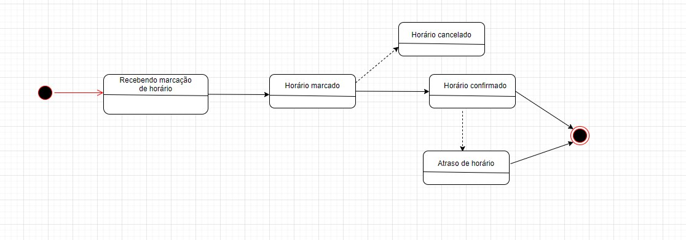

# 
 Diagrama de Estados

## Histórico de versão
|Data | Versão | Descrição | Autor(es)
| -- | -- | -- | -- |
| 24.02.2021 | 0.1 | Criação do documento | Isabella Carneiro |
| 26.02.2021 | 0.2 | Adição da imagem do diagrama | Isabella Carneiro |
| 02.03.2021 | 0.2 | Adição de participantes, Metodologia Resultado e referências | Geraldo Victor |

### Participantes
- Geraldo Victor
- Isabella Carneiro

### Metodologia
O diagrama de estados é um diagrama que mostra discretamente o comportamento designado de parte de um sistema através de estados finitos de transições. Ele ajuda a identificar os fluxos dos processos envolvidos na aplicação, onde eles começam, terminam ou se repetem até que uma dada condição seja satisfeita.

### Resultado
Através da identificação do fluxo que o sistema deve seguir para marcar um horário foi elaborado o seguinte diagrama:
[

](../../img/diagrama-estado.jpg)
Dessa forma é de grande valia o uso deste tipo de diagrama, pois ele deixa claro para a equipe qual deverá ser o fluxo da aplicação para o agendamento de um horário.

## Referências

SERRANO, Milene. **Modelagem - Diagrama de Estados**, 2021. Vídeo-aulas complementares apresentadas na Disciplina de Arquitetura e Desenho de Software do curso de engenharia de software da UnB, FGA. Acesso em: 26 de fevereiro de 2021.
