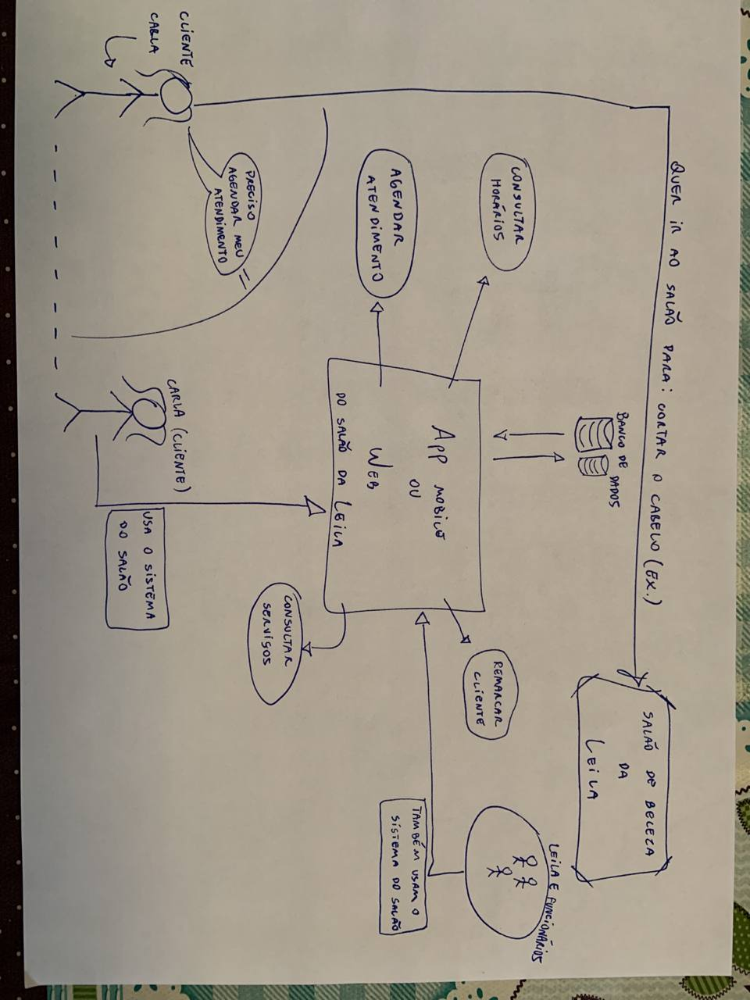

# 
 Rich Picture
## Histórico de versão

|Data | Versão | Descrição | Autor(es)
| -- | -- | -- | -- |
| 10.02.2021 | 0.1 | Criação do documento | Erick Giffoni|
| 10.02.2021 | 0.2 | Adição inicial dos Rich Pictures 1 e 2| Erick Giffoni|
| 10.02.2021 | 0.3 | Rotaciona o Rich Picture 1 | Erick Giffoni|
| 12.02.2021 | 1.0 | Adição das descrições dos Rich Pictures 1 e 2| Erick Giffoni|
| 12.02.2021 | 1.1 | Adiciona hyperlinks para os Rich Pictures 1 e 2 e corrige o texto em Resultados| Erick Giffoni|

## Metodologia
  
Rich Pictures são artefatos que podem ser utilizados logo no começo do processo de elicitação. 
Trata-se de um artefato que não precisa ter orientação metodológica específica para usá-lo. 

O Rich Picture ajuda a entender melhor o contexto de uso de uma aplicação, por exemplo,  
porque ele consegue ilustrar graficamente uma situação para a qual pretende-se construir um  
software.

### Participantes

* Erick Giffoni

## Resultado

> Do que se trata esse Rich Picture ?

A ideia é representar o contexto diário do salão da cabeleireira Leila, bem como o *modus operandi* 
por meio do qual ela recebe clientes e fornece serviços.

Já sabemos de algumas dificuldades que a Leila tem no dia-a-dia dela no estabelecimento, 
e isso pode ser visualizado no [diagrama de causa e efeito](./causa-efeito.md).

Assim, a primeira versão do Rich Picture para o Salão da Cabeleleira Leila propõe uma 
abordagem simples para resolver aqueles problemas. Vide abaixo :

<a href="https://unbbr-my.sharepoint.com/:i:/g/personal/160010900_aluno_unb_br/EYMTM7Rw6YRJlJsoqjDfc-EBiFaI45dA3va4I9hEJOP22A?e=ylhkQ0">
> Rich Picture - v1.0 

</a>

Nessa primeira versão, temos ilustrada uma situação em que uma cliente pretende cortar o 
cabelo no salão da Leila. Para isso, ela recorre à aplicação web do estabelecimento, a 
qual tem diversas funcionalidades, como, por exemplo, agendar um atendimento.

Vale ressaltar que não só a cliente, mas também a Leila e os funcionários dela usam a 
aplicação, sendo que esta troca informações constantemente com um banco de dados.

Nossa equipe, responsável por tornar a demanda de um sistema para o salão da Leila 
realidade, realizou um [brainstorm](./brainstorming.md) inicial e, a partir dele, conseguiu elicitar alguns 
requisitos para o sistema em questão.

A partir disso, um novo Rich Picture foi feito, o qual trás mais algumas informações sobre 
aquele universo do estabelecimento da Leila. Vide abaixo :

<a href="https://unbbr-my.sharepoint.com/:i:/g/personal/160010900_aluno_unb_br/ETYj5DE7jzpJlYqTOEbvFr4BKU6EAvdXZfw3sGmuQhKtvA?e=WBVqt2">
> Rich Picture - v2.0 

</a>

Essa segunda versão do Rich Picture ilustra uma nova cliente que deseja um serviço oferecido 
pelo estabelecimento. Leila, então, utiliza do sistema para cadastrar a nova cliente. Esta, 
assim, já pode usufruir da aplicação para conseguir o que deseja.

O Salão da Cabeleleira Leila continua comunicando-se com um banco de dados; os funcionários 
permanecem utilizando esse sistema; e houve uma adição do que pode ser uma central de controle 
do sistema, responsável por verificar, por exemplo, qual o tipo de requisição está sendo feita 
(ex.: uma cliente tentando agendar um horário para pintar o cabelo, ou um funcionário que vai 
notificar um atraso).

<a href="">
> To-do: Rich Picture - v3.0 

</a>

## Referências

- Livro: SOMMERVILLE, Ian. Engenharia de Software. 9a edição, São Paulo: Pearson, 2011.
- Livro: BARBOSA, S. D. J.; SILVA, B. S. Interação Humano-Computador. 1a edição, Rio de Janeiro: Elsevier, 2010.
- Videoaula - DSW - Base - RichPicture. SERRANO, Milene. Universidade de Brasília, 2021.
