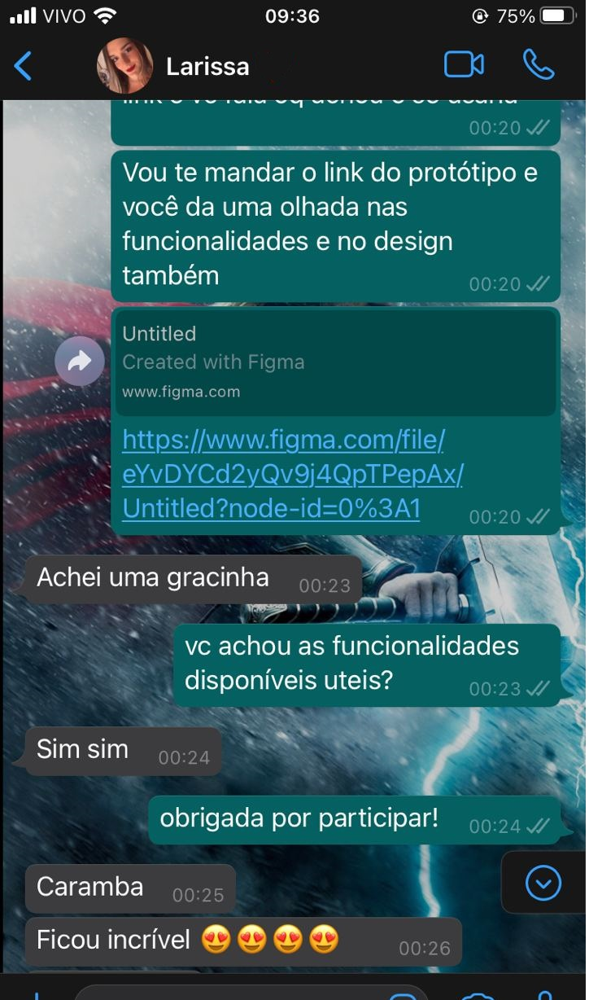
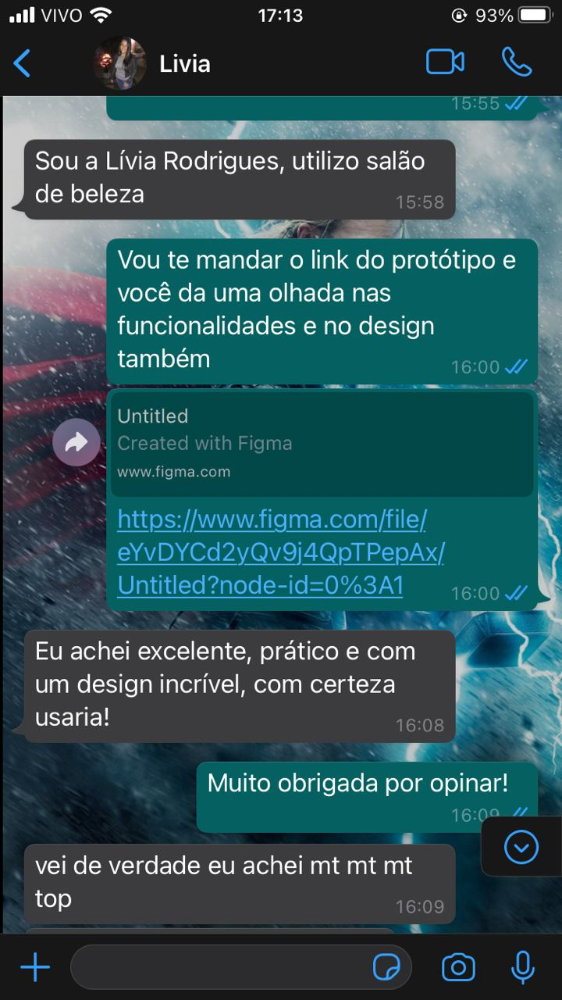

# 
 Protótipo de alta fidelidade

### Histórico de versão
|Data | Versão | Descrição | Autor(es)
| -- | -- | -- | -- |
| 17.02.2021 | 0.1 | Criação do documento | Isabella Carneiro |
| 17.02.2021 | 1.0 | Adição das imagens | Isabella Carneiro |
| 17.02.2021 | 1.1 | Inclusão de legendas às imagens | Rafaella Junqueira |

## Participantes
- Isabella Carneiro
- Rafaella Junqueira

## Metodologia
 
Para a realização dos testes dos protótipos de alta fidelidade foi utilizado o Whatsapp para receber feedback de possíveis usuários da plataforma acerca do protótipo feito.
Tal teste tem como objetivo analisar a partir da opinião dos participantes se o protótipo tem algum problema de usabilidade ou se alguma funcionalidade não é de relevância do escopo.

## Resultado
 

    <figcaption align='center'>
    <b>Figura 1: Primeiro feedback</b>
     
    <small>Autor: Isabella Carneiro</small>
    </figcaption>

 

    <figcaption align='center'>
    <b>Figura 2: Segundo feedback</b>
     
    <small>Autor: Isabella Carneiro</small>
    </figcaption>

 

    <figcaption align='center'>
    <b>Figura 3: Terceiro feedback</b>
     
    <small>Autor: Isabella Carneiro</small>
    </figcaption>

 

    <figcaption align='center'>
    <b>Figura 4: Quarto feedback</b>
     
    <small>Autor: Isabella Carneiro</small>
    </figcaption>

 

De acordo com os testes o protótipo é válido, suas funcionalidades estão de acordo com o que um usuário esperaria do sistema e o design é adequado.

## Referências

Prototipação. http://web.mit.edu/6.813/www/sp17/classes/08-prototyping/. Acesso em 08 de fevereiro de 2021.
