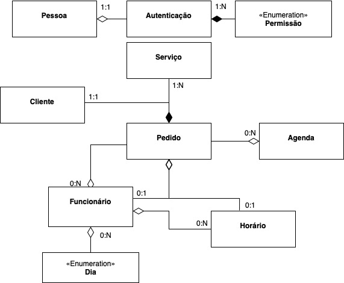

# 
 Diagrama de Agregação e Composição
## Histórico de versão

|Data | Versão | Descrição | Autor(es)
| -- | -- | -- | -- |
| 26.02.2021 | 0.1 | Criação do documento | Erick Giffoni|
| 26.02.2021 | 0.2 | Adiciona a metodologia utilizada | Erick Giffoni|
| 26.02.2021 | 0.3 | Adiciona o diagrama na versão 1 | Erick Giffoni, Lucas Lopes|

## Metodologia
  
O Diagrama de Agregação e Composição representa como as diferentes classes de 
um projeto de software se relacionam. Dessa forma, ele se parece com a representação 
de relacionamentos entre entidades de um banco de dados, por exemplo, por meio do 
diagrama de entidade-relacionamento.

O foco não é mostrar com detalhes os métodos e os atributos de cada classe, mas sim 
deixar claro como elas se comunicam, como dependem umas das outras etc. Assim, ficam 
visíveis aspectos como modularidade, coesão e acoplamento.

Para realizar esse diagrama para o projeto do sistema do Salão da Leila, nossa equipe 
baseou-se no Diagrama de Classes que fora previamente projetado. Houve uma renião virtual 
na qual nós fizemos a diagramação completa das agregações e das composições entre as 
classes existentes no referido projeto.

### Participantes

* Erick Giffoni
* Lucas Lopes Pereira

## Resultado

> Do que se trata esse Diagrama ?

A ideia é 

<a href="https://unbbr-my.sharepoint.com/:i:/g/personal/160010900_aluno_unb_br/EcwQ-rqfxWpKpvmscK5laT4BH3og0hySa9Y5mS5UDzF8eg?e=5BK3JS">

> Diagrama de Agregação e Composição - v1.0  

</a>

Nessa primeira versão, 
## Referências

- PRESSMAN, Roger S. Engenharia de Software: uma abordagem profissional. 7a edição, Porto Alegre: AMGH, 2011.
- SOMMERVILLE, Ian. Engenharia de Software. 9a edição, São Paulo: Pearson, 2011.
- Videoaula - DSW - Modelagem - Diagrama de Agregação e Composição. SERRANO, Milene. Universidade de Brasília, 2021.
- Diagrams.net. Disponível em : [www.diagrams.net](https://www.diagrams.net) .
