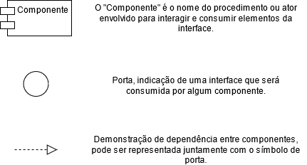
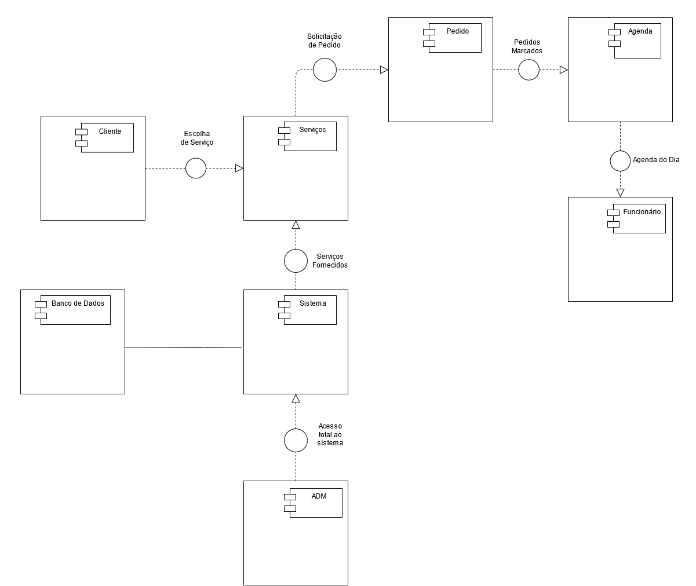

# 
 Diagrama de Componentes
 

### Histórico de versão
|Data | Versão | Descrição | Autor(es)
| -- | -- | -- | -- |
| 03.03.2021 | 0.1 | Criação do documento | Isabella Carneiro|
| 03.03.2021 | 0.2 | Adição da metodologia e referências | Bruna Almeida |
| 03.03.2021 | 1.0 | Adição do diagrama | Bruna Almeida, Isabella Carneiro, Damarcones Porto |
| 07.03.2021 | 1.0 | Revisão do documento e sugestão de melhorias | Erick Giffoni |

### Participantes

* Bruna Almeida 
* Isabella Carneiro
* Damarcones Porto
* Erick Giffoni (Revisão)

 

## Introdução

Os diagramas de componentes são usados para visualizar a organização dos componentes do sistema e os relacionamentos de dependência entre eles.

Os componentes podem ser um componente de software, como um banco de dados ou interface de usuário; ou um componente de hardware, como um circuito, microchip ou dispositivo; ou uma unidade de negócios, como fornecedor, folha de pagamento ou envio.

Esse tipo de diagrama pode ser utilizado para mostrar a estrutura do código-fonte do sistema, para focar na relação entre componentes enquanto esconde detalhes de especificação, e também ajudar na comunicação e explicação das funções do sistema que está a ser construído às partes interessadas.

O diagrama de componentes em UML dá uma visão geral do sistema de software. A partir dele, a equipe pode imaginar a estrutura física do sistema, bem como prestar atenção aos componentes do sistema e como eles se relacionam. Além disso, o diagrama enfatiza o comportamento do serviço quanto à interface.

Basicamente, o diagrama de componentes deve mostrar: o escopo do sistema; a estrutura geral do sistema de software; e as metas que o sistema ajuda entidades humanas ou não humanas a atingir.

A seguir são apresentados os componentes utilizados na construção do diagrama de componentes para o projeto:

 

[

](../../img/legendas_elementos.png)

<figcaption>

    <b>Figura 1: Legenda para os componentes utilizados no diagrama.</b>
     
    <small>Autor: Damarcones Porto</small>
</figcaption>
 

 

## Metodologia

A modelagem do diagrama de componentes foi desenvolvida utilizando a ferramenta [Draw.io](/https://app.diagrams.net/) durante a reunião entre os integrantes do grupo a fim de discutir a melhor forma de representar os componentes que serão utilizados ao longo do projeto e suas relações.

## Diagrama

[

](../../img/diagrama-componentes.png)

<figcaption>

    <b>Figura 2: Diagrama de componentes.</b>
     
    <small>Autores: Isabella Carneiro, Damarcones Porto</small>
</figcaption>
 

Diagrama de componentes elaborado a partir do diagrama de classes, demonstrando como ocorrerá as interações entre componentes e processos dentro do sistema, juntamente com a ação de usuários, funcionários e administradores.

 

### Referências

Diagramas desenvolvidos na plataforma <a href="https://app.diagrams.net/">Draw.io</a>.
 "Diagrama de componentes UML: o que é, como fazer e exemplos"</i>. Disponível em <a href=https://www.lucidchart.com/pages/pt/diagrama-de-componentes-uml>lucidchart.com</a>.
 "O Guia Fácil de Diagramas de Componentes"</i>. Disponível em <a href=https://creately.com/blog/pt/diagrama/tutorial-de-diagrama-de-componentes-2>creately.com</a>.
 Diagrama de Componentes</i>. Disponível em <a href=https://homepages.dcc.ufmg.br/~amendes/GlossarioUML/glossario/conteudo/componentes/diagrama_de_componentes.htm>homepages.dcc.ufmg.br</a>.
