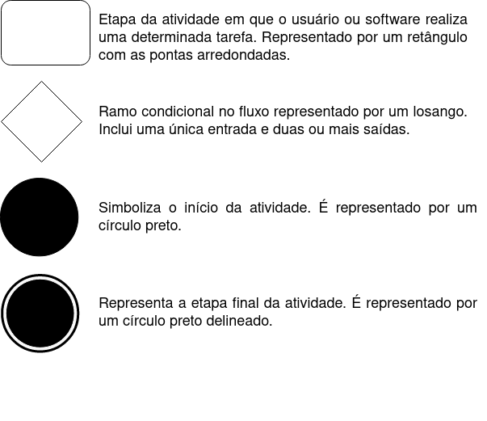

# 
 Diagrama de Atividades
 

### Histórico de versão
|Data | Versão | Descrição | Autor(es)
| -- | -- | -- | -- |
| 27.02.2021 | 0.1 | Criação do documento |Damarcones|
| 28.02.2021 | 0.2 | Adição dos Diagramas de Atividades |Bruna, Damarcones|
| 01.03.2021 | 0.3 | Revisão do documento de Diagramas de Atividades |Isabella, Erick|
| 03.03.2021 | 1.0 | Adição de descrição dos diagramas |Bruna, Damarcones|
| 06.03.2021 | 1.1 | Adição da introdução e refatoração das referências | Bruna, Damarcones |
| 06.03.2021 | 1.2 | Adição da metodologia | Bruna, Damarcones |
| 07.03.2021 | 1.3 | Alteração das descrições das imagens | Bruna, Damarcones |
| 07.03.2021 | 1.3 | Revisão do documento | Erick |
| 08.03.2021 | 1.4 | Revisão do documento | Lucas |
| 09.03.2021 | 1.5 | Correção do endereçamento das imagens e texto incoerente | Damarcones |

### Participantes

* Bruna Almeida 
* Damarcones Porto
* Erick Giffoni (Revisão)
* Isabella Carneiro
* Lucas Lopes (Revisão)

 

## Introdução

O Diagrama de Atividades, assim como os diagramas de casos de uso e de estado, é usado para descrever as funcionalidades importantes da aplicação. Com o diagrama de atividades é possível ter uma visão rápida e clara dos processos que serão necessários na aplicação, facilitando o entendimento de toda equipe de produção e clientes.

Um diagrama de atividades mostra o fluxo de uma atividade para outra em um sistema. Uma atividade mostra um conjunto de atividades, o fluxo sequencial ou ramificado de uma atividade para outra e os objetos que realizam ou sofrem ações. Esses diagramas são importantes principalmente para fazer a modelagem da função de um sistema.

O objetivo do diagrama de atividades é mostrar o fluxo de atividades em um único processo. O diagrama mostra como uma atividade depende uma da outra.

Diagramas de atividade oferecem uma série de benefícios para o entendimento do sistema, como: demonstrar a lógica de um algoritmo; ilustrar um processo de negócio ou fluxo de trabalho entre usuários e o sistema; e modelar elementos de arquitetura de software, como método, função e operação.

Os símbolos utilizados no diagrama de atividades do projeto do Salão da Leila estão apresentados a seguir:

 

[

](/../../img/diagrama_atividades/legenda-atividade.png)
<figcaption align="center">
    <b>Figura 01 - Símbolos utilizados no Diagrama de Atividades.</b>
     
    <small>Autores: Bruna e Damarcones</small>
</figcaption>
 

## Metodologia

Os diagramas foram desenvolvidos na plataforma <a href="https://app.diagrams.net/">Draw.io</a>, pelos integrantes Bruna Almeida e Damarcones Porto, entre os dias 27 e 28 de fevereiro de 2021. A construção dos diagramas se deu através de reuniões online.

 

## Diagramas
 

#### Login (V1)

[

](../../img/diagrama_atividades/diagrama_tarefas_login.png)
<figcaption align="center">
    <b>Diagrama 01 - Realização de Login.</b>
     
    <small>Autores: Bruna e Damarcones</small>
</figcaption>
 

O diagrama apresenta as ações necessárias para que seja possível realizar o login e suas possíveis ações, dependendo do que ocorra na requisição.

 

<!-- ----------------------------------------------------------------------------------------------------------------- -->
### Cadastro (V1)

[

](../../img/diagrama_atividades/diagrama_tarefas_cadastro.png)
<figcaption align="center">
    <b>Diagrama 02 - Realização de Cadastro.</b>
     
    <small>Autores: Bruna e Damarcones</small>
</figcaption>
 

O diagrama apresenta como se dará o processo de cadastro dos usuários e de funcionários.

 

<!-- ----------------------------------------------------------------------------------------------------------------- -->
### Marcar Horário (V1)

[

](../../img/diagrama_atividades/diagrama_tarefas_marcar_horario.png)
<figcaption align="center">
    <b>Diagrama 03 - Realização de Marcação de Horário.</b>
     
    <small>Autores: Bruna e Damarcones</small>
</figcaption>
 

O diagrama descreve como realizar a marcação de horário e os possíveis filtros a serem utilizados para a marcação do mesmo.

 

<!-- ----------------------------------------------------------------------------------------------------------------- -->
### Avaliação (V1)

[

](../../img/diagrama_atividades/diagrama_tarefas_avaliacao.png)
<figcaption align="center">
    <b>Diagrama 04 - Realização de Avaliação.</b>
     
    <small>Autores: Bruna e Damarcones</small>
</figcaption>
 

Modo pelo qual será realizado a avaliação do serviço que foi utilizado no salão, juntamente com o funcionário que o realizou. 

 

<!-- ----------------------------------------------------------------------------------------------------------------- -->
### Referências

- 
G. Booch, J. Rumbaugh, I. Jacobson. <b>UML, Guia do Usuário</b>. 2ª Ed., Editora Campus, 2005.

- 
<b>O que é diagrama de atividades UML?</b>. Disponível em: <a href="https://www.lucidchart.com/pages/pt/o-que-e-diagrama-de-atividades-uml">lucidchart.com/pages/pt/o-que-e-diagrama-de-atividades-uml</a>. Acesso em 28 de fevereiro de 2021.

- 
<b>Diagrama de Atividades</b>. Disponível em: <a href=https://homepages.dcc.ufmg.br/~amendes/GlossarioUML/glossario/conteudo/atividades/diagrama_de_atividades.htm>ufmg.br/~amendes/GlossarioUML/glossario/conteudo/atividades/diagrama_de_atividades.htm</a>. Acesso em 28 de fevereiro de 2021.

- 
</a><b>Diagrama de Atividades</b>. Disponível em: <a href=http://www.dsc.ufcg.edu.br/~jacques/cursos/map/html/uml/diagramas/atividades/diag_atividades.htm>ufcg.edu.br/~jacques/cursos/map/html/uml/diagramas/atividades/diag_atividades.htm</a>. Acesso em 04 de março de 2021.

