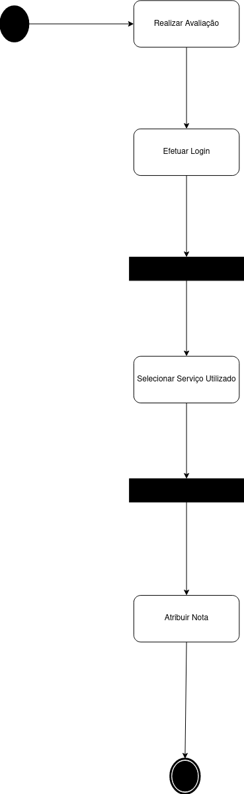

# 
 Diagrama de Comunicação
 

### Histórico de versão
|Data | Versão | Descrição | Autor(es)
| -- | -- | -- | -- |
| 04/03 | 0.1 | Criação do documento | Bruna Almeida |
| 06/03 | 0.2 | Adição da introdução e referências | Bruna Almeida e Damarcones Porto |

### Participantes

* Bruna Almeida 
* Damarcones Porto
* Lucas Lopes

 

### Introdução

Diagramas de comunicação são um tipo de diagrama de interação que pode ser usado para explorar o comportamento dinâmico de um sistema de software. Na UML, um diagrama de comunicação mostra as interações entre os objetos ou funções associados com linhas de vida e mensagens transmitidas entre linhas de vida. Em versões anteriores do UML, esse diagrama era denominado diagrama de colaboração e possuía uma notação diferente.

Os diagramas de comunicação são utilizados para mostrar como os objetos interagem para executar o comportamento de um caso de uso específico ou de parte de um caso de uso.

O diagrama está amplamente associado ao Diagrama de Sequência: na verdade, um complementa o outro. As informações mostradas no diagrama de comunicação são, com frequência, praticamente as mesmas apresentadas no diagrama de sequência, porém com um enfoque diferente, visto que esse diagrama não se preocupa com a temporalidade do processo, concentrando-se em como os elementos do diagrama estão vinculados e quais mensagens trocam entre si durante o processo.

Os diagramas de comunicação assemelham-se aos diagramas de objetos, nos quais uma linha de vida representa os objetos na interação e as setas representam as mensagens transmitidas entre as linhas de vida. Pontas de setas indicam a direção das mensagens, para frente ou para trás, e números de sequência indicam a ordem na qual as mensagens são transmitidas.

 

## Metodologia

O diagrama de comunicação referente ao projeto do Salão da Leila foi desenvolvido pelo integrante da equipe Lucas Lopes, com apoio dos integrantes Bruna Almeida e Damarcones Porto. A construção do diagrama se deu entre os dias 05 e 06 de março, através de reuniões online, utilizando a plataforma <a href=https://app.diagrams.net/>Draw.io</a> para a criação do diagrama.

 

## Diagrama

<!-- 

  

        
 
    

    <figcaption>
<i>Diagrama 04 - Realização de Avaliação.</i></figcaption>

Maneira de como será realizado a avaliação do serviço que foi utilizado no salão juntamente com o funcionário que o realizou. 
 -->

 

### Referências

- 
G. Booch, J. Rumbaugh, I. Jacobson. <b>UML, Guia do Usuário</b>. 2ª Ed., Editora Campus, 2005.

- 
<b>Diagramas de comunicação</b>. Disponível em: <a href=https://www.ibm.com/support/knowledgecenter/pt-br/SS8PJ7_9.6.1/com.ibm.xtools.sequence.doc/topics/ccommndiag.html>ibm.com/support/knowledgecenter/pt-br/SS8PJ7_9.6.1/com.ibm.xtools.sequence.doc/topics/ccommndiag.html</a>. Acesso em 04 de março de 2021.

- 
<b>Diretriz: Diagrama de Comunicação</b>. Disponível em: <a href=https://www.cin.ufpe.br/~gta/rup-vc/core.base_rup/guidances/guidelines/communication_diagram_FFFEA1B5.html?nodeId=3c470376>cin.ufpe.br/~gta/rup-vc/core.base_rup/guidances/guidelines/communication_diagram_FFFEA1B5.html?nodeId=3c470376</a>. Acesso em 04 de março de 2021.

- 
<b>Diagrama de Comunicação</b>. Disponível em: <a href=https://monitoriadeengenhariadesoftware.wordpress.com/2016/03/20/diagrama-de-comunicacao/>monitoriadeengenhariadesoftware.wordpress.com/2016/03/20/diagrama-de-comunicacao/</a>. Acesso em 06 de março de 2021.

- 
Slides: <b>Diagrama de Comunicação</b>. Autor: Diagrama de Comunicação.  Disponível em: <a href=https://homepages.dcc.ufmg.br/~figueiredo/disciplinas/aulas/uml-diagrama-comunicacao_v01.pdf>homepages.dcc.ufmg.br/~figueiredo/disciplinas/aulas/uml-diagrama-comunicacao_v01.pdf</a>. Acesso em 06 de março de 2021.
