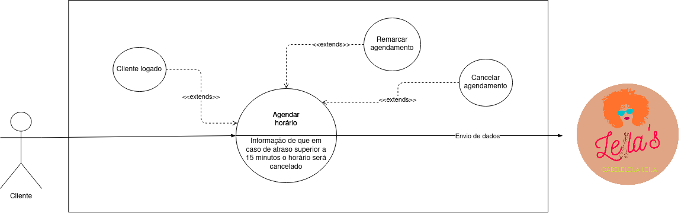

## UCD10 - Agendar horário 

[

](../../../../img/diagramas-casos-uso/diagramas-v1/uc10.png)
<figcaption align='center'>
    <b>Figura 1: Caso de uso referente ao agendamento de horários</b>
     
    <small>Autor: Damarcones Porto</small>
</figcaption>
 