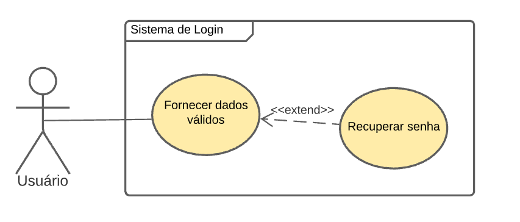

## 
UC02 - Realizar login

[

](../../../../img/diagramas-casos-uso/diagramas-v2/UC02.png)
<figcaption align='center'>
    <b>Figura 1: Caso de uso referente à realização de login</b>
     
    <small>Autor: Rafaella Junqueira</small>
</figcaption>
 

### Especificação do diagrama

|| |
|--| -- |
**Descrição** | O usuário deve acessar o sistema utilizando credenciais cadastradas|
**Atores** | Usuários do sistema |
**Pré-requisitos** | O usuário deve ter sido previamente cadastrado e não pode estar logado ao sistema.|
**Fluxo principal** |1. O usuário acessa o sistema 2. O usuário clica sobre o botão de "login" 3. O usuário insere credenciais válidas |
**Pós condição** | Usuário logado e com permissão para consulta às demais funcionalidades do sistema.|