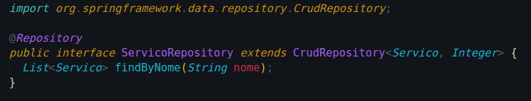

# 
 GRASP Baixo Acoplamento
 
    
### Histórico de versão 
    
|Data | Versão | Descrição | Autor(es)|
| -- | -- | -- | -- |
| 25.03.2021 | 0.1 | Criação do documento | Rafaella Junqueira Kalebe Lopes|
| 25.03.2021 | 0.2 | Adição do diagrama UML | Rafaella Junqueira Kalebe Lopes|
| 28.03.2021 | 1.0 | Edição e revisão da versão 1.0 | Erick Giffoni |
| 28.03.2021 | 1.0 | Revisão do documento | Isabella Carneiro |

### Participantes

* Rafaella Junqueira
* Kalebe Lopes
* Erick Giffoni
* Isabella Carneiro

### Introdução

O padrão de Baixo Acoplamento é um padrão de avaliação, que determina como atribuir responsabilidades de suporte de modo que o acoplamento entre classes permaneça baixo. A utilização deste padrão oferece benefícios, como menor dependência entre as classes, redução de impacto das mudanças e aumento do potencial de reutilização das classes.
  

### Aplicações no projeto

Os códigos criados utilizam a divisão de responsabilidades entre as classes, de modo que, para a evitar a dependência entre elas, existem interfaces que abarcam os métodos comuns a todas. Assim, caso haja necessidade de mudanças, basta alterar apenas a interface específica daquela classe.
  
As imagens abaixo exemplificam o baixo acoplamento entre a classe de serviço ServicoService e a interface ServicoRepository, a qual herda a implementação dos métodos advindos da interface CrudRepository. Além disso, nos exemplos é possível perceber aspectos relacionados ao polimorfismo, como, por exemplo, a sobrescrita de métodos.

 

[

](../../img/padroes/servico-repository.png)
<figcaption align='center'>
    <b>Figura 1 - Interface que implementa a interface crud</b>
</figcaption>
 

[

](../../img/padroes/servico-interface.png)
<figcaption align='center'>
    <b>Figura 2 - Utilização da interface ServicoRepository pela classe ServicoService</b>
</figcaption>
 

Veja que a classe ServicoService, na figura 2, tem um atributo 'repository' do tipo ServicoRepository.

### Modelagem UML

Para melhor representar o funcionamento do padrão GRASP de baixo acoplamento adotado no projeto, foi modelado um diagrama UML exemplificando a utilização da interface ServiceRepository por parte da classe de serviço intitulada ServicoService.

[

](../../img/padroes/baixo-acoplamento.png)
<figcaption align='center'>
    <b>Figura 3 - Exemplo de uso de interface pela classe ServicoService</b>
     
    <small>Autores: Rafaella Junqueira e Kalebe Lopes</small>
</figcaption>
 

Note, mais uma vez, que a classe ServicoService usa a ServicoRepository, e esta tem herança da CrudRepository.

  

Vale lembrar que esse padrão está sendo amplamente utilizado no projeto, entretanto, para fins de explicação e para não tornar este documento longo, utilizamos apenas exemplos relacionados aos serviços oferecidos pelo salão da Leila.

## Referências
 

Universidade Federal de Uberlândia. **Padrões GRASPs** Disponível em [http://www.facom.ufu.br/~bacala/ESOF/05a-Padr%C3%B5es%20GRASP.pdf](http://www.facom.ufu.br/~bacala/ESOF/05a-Padr%C3%B5es%20GRASP.pdf). Acesso em 12 de março de 2021.
