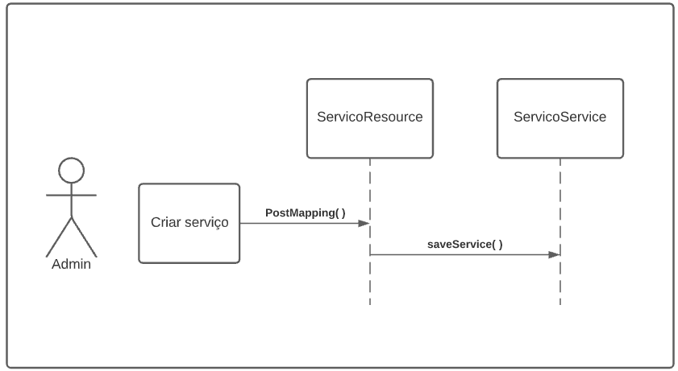

# 
 GRASP Controller
 
### Histórico de versão 
|Data | Versão | Descrição | Autor(es)
| -- | -- | -- | -- |
| 25.02.2021 | 0.1 | Criação do documento | Rafaella Junqueira Erick Giffoni|
| 25.02.2021 | 0.2 | Adição do diagrama UML | Rafaella Junqueira Kalebe Lopes |

### Participantes

* Rafaella Junqueira
* Kalebe Lopes
* Erick Giffoni

### Introdução

O padrão Controller (ou Controlador) é aquele que atribui a responsabilidade de lidar com os eventos do sistema para uma classe que representa um cenário de caso de uso do sistema global. Um objeto controlador é um objeto de interface não-usuário, responsável por receber ou manipular um evento do sistema. O controlador é definido como o primeiro objeto além da camada UI que recebe e coordena as operações do sistema, e deve delegar o trabalho a ser feito aos outros objetos.
  
O padrão visa responder a seguinte pergunta: Quem deve ser o responsável por lidar com um evento de uma interface de entrada?. Ainda, este padrão pode ser considerado uma parte da camada de aplicação/serviço, uma vez que a aplicação tenha feito uma distinção explícita entre a camada de aplicativo/serviço e a camada de domínio em um sistema orientado a objetos.

 

### Aplicação no projeto

A parte Backend do projeto está estruturado de forma que o diretório web/resources recebe os arquivos responsáveis por realizar o primeiro contato das requisições provenientes do Frontend, assim, assumem o papel de controladores da aplicação. A responsabilidade de lidar com o pedido recebido é atribuída aos arquivos alocados na pasta services.

 

[

](../../img/padroes/services-backend.png)
<figcaption align='center'>
    <b>Figura 1 - Estruturação do projeto</b>
</figcaption>
 

O exemplo abaixo mostra o controlador dos serviços, ServicoResource.java, onde cada tipo de requisição https é mapeada por um método específico. Cada método irá capturar o tipo da requisição, como por exemplo um get, put, post ou delete, e atribuir a responsabilidade ao arquivo ServicoService.java.

[

](../../img/padroes/servico-resource.png)
<figcaption align='center'>
    <b>Figura 2 - Controlador ServicoResource</b>
</figcaption>
 

[

](../../img/padroes/servico-service.png)
<figcaption align='center'>
    <b>Figura 3 - Model ServicoService</b>
</figcaption>
 

### Modelagem UML

Para melhor representar o funcionamento do padrão GRASP controller adotado no projeto, foi modelado um diagrama UML exemplificando a criação de um serviço por parte do usuário administrador. A imagem demonstra o fluxo entre uma requisição realizada no Frontend e seu primeiro contato com o Backend via ServicoResource, seguindo para o ServicoService, onde será tomada a ação se criar o serviço solicitado.

[

](../../img/padroes/uml-controller.png)
<figcaption align='center'>
    <b>Figura 4 - Exemplo de criação de um serviço</b>
     
    <small>Autores: Rafaella Junqueira e Kalebe Lopes</small>
</figcaption>
 

## Referências
 
SERRANO, Milene. **Demais GRASPs**, 2021. Material apresentado na Disciplina de Arquitetura e Desenho de Software do curso de engenharia de software da UnB, FGA. Acesso em 9 de março de 2021.

DEVMEDIA, **Desenvolvimento com qualidade com GRASP** Disponível em [https://www.devmedia.com.br/desenvolvimento-com-qualidade-com-grasp/28704](https://www.devmedia.com.br/desenvolvimento-com-qualidade-com-grasp/28704) Acesso em 9 de março de 2021.
