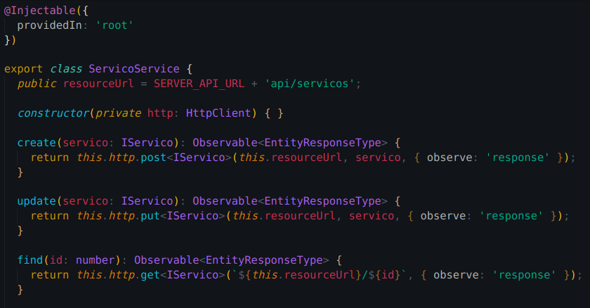
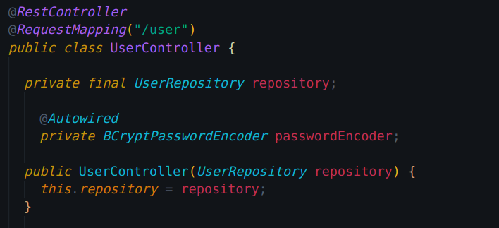

# 
 Injeção de Dependência
 
    
### Histórico de versão 

|Data | Versão | Descrição | Autor(es)|
| -- | -- | -- | -- |
| 06.04.2021 | 0.1 | Criação do documento | Rafaella Junqueira Lucas Lopes|
| 06.04.2021 | 0.2 | Adicao do diagrama UML | Rafaella Junqueira Lucas Lopes|

### Participantes

* Rafaella Junqueira
* Lucas Lopes

### Introdução

Injeção de Dependência é um padrão de projeto usado para evitar o alto nível de acoplamento de código dentro de uma aplicação. É um padrão baseado em abstrações, sejam elas classes abstratas ou interfaces, e consiste em passar uma classe que será utilizada para uma classe que irá consumi-la.

Pode-se trabalhar com a injeção de dependência de três maneiras: injeção por construtor (constructor injection), injeção por propriedade ( setter injection ), e injeção por interface ( interface injection ).

### Metodologia

A documentação do padrão GoF Builder, assim como a modelagem do diagrama UML, foi realizada por meio de reuniões da equipe através da plataforma Discord. O diagrama foi modelado utilizando a ferramenta <a href="https://www.lucidchart.com/">Lucidchart.</a>

### Aplicação no projeto

O padrão de injeção de dependências pode ser visto tanto no frontend quanto no backend, aplicado ao framework Angular e Spring Boot, respectivamente. A primeira imagem indica a aplicação do padrão por meio da injeção por construtor da classe ServicoService.

[

](../../img/padroes/injecao1.png)
<figcaption align='center'>
    <b>Figura 1 - Padrão aplicado ao frontend</b>
</figcaption>
 

A imagem abaixo indica injeção de dependência no backend por meio do construtor, indicado pelo método public UserController, e também via propriedade através da notation @Autowired acima da propriedade privada da classe.

[

](../../img/padroes/injecao2.png)
<figcaption align='center'>
    <b>Figura 2 - Padrão aplicado ao backend</b>
</figcaption>
 

### Modelagem UML

[

](../../img/padroes/uml-injecao.png)
<figcaption align='center'>
    <b>Figura 3 - Representação do padrão utilizado no backend</b>
     
    <small>Autores: Rafaella Junqueira e Lucas Lopes</small>
</figcaption>
 

## Referências
 
Eduardo Lanfredi, **Injeção de Dependência**. Disponível em [https://medium.com/@eduardolanfredi/inje%C3%A7%C3%A3o-de-depend%C3%AAncia-ff0372a1672#:~:text=Inje%C3%A7%C3%A3o%20de%20Depend%C3%AAncia%20%C3%A9%20um,c%C3%B3digo%20dentro%20de%20uma%20aplica%C3%A7%C3%A3o.](https://medium.com/@eduardolanfredi/inje%C3%A7%C3%A3o-de-depend%C3%AAncia-ff0372a1672#:~:text=Inje%C3%A7%C3%A3o%20de%20Depend%C3%AAncia%20%C3%A9%20um,c%C3%B3digo%20dentro%20de%20uma%20aplica%C3%A7%C3%A3o.) Acesso em 6 de abril de 2021.

DEVMEDIA, **Injeção de Dependência**. Disponível em [https://www.devmedia.com.br/padrao-de-injecao-de-dependencia/18506](https://www.devmedia.com.br/padrao-de-injecao-de-dependencia/18506) Acesso em 6 de abril de 2021.