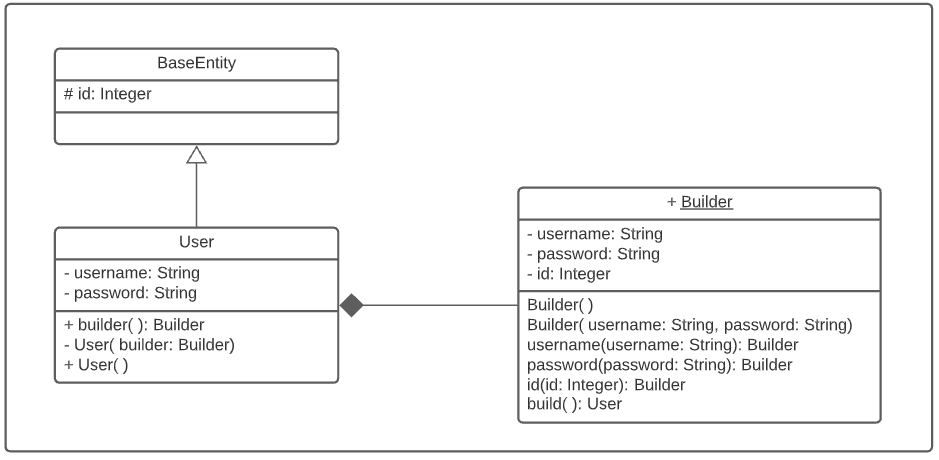

# 
 Builder
 
    
### Histórico de versão 

|Data | Versão | Descrição | Autor(es)|
| -- | -- | -- | -- |
| 06.04.2021 | 0.1 | Criação do documento | Rafaella Junqueira Lucas Lopes Isabella Carneiro Damarcones Porto Bruna Almeida|
| 06.04.2021 | 0.2 | Adição do diagrama UML | Rafaella Junqueira  Lucas Lopes |

### Participantes

* Rafaella Junqueira
* Lucas Lopes
* Isabella Carneiro
* Damarcones Porto
* Bruna Almeida

### Introdução

O Builder é um padrão de projeto criacional que permite a produção de diferentes tipos e representações de um objeto usando o mesmo código de construção. Esse padrão ajuda a encapsular a construção de um produto e permitir que ele seja construído em etapas, além de ser projetado para fornecer uma solução flexível para vários problemas de criação de objetos. A intenção do padrão Builder é separar a construção de um objeto complexo de sua representação.

 

### Metodologia

A documentação do padrão GoF Builder, assim como a modelagem do diagrama UML, foi realizada por meio de reuniões da equipe através da plataforma Discord. O diagrama foi modelado utilizando a ferramenta <a href="https://www.lucidchart.com/">Lucidchart.</a>  

 

### Aplicação no projeto

O projeto utiliza o padrão, por exemplo, forma de um construtor dado pela classe Builder que implementa os métodos privados da classe User.

[

](../../img/padroes/builder.png)
<figcaption align='center'>
    <b>Figura 1 - Representação do objeto User</b>
</figcaption>
 

[

](../../img/padroes/builder-2.png)
<figcaption align='center'>
    <b>Figura 2 - Implementação do objeto User</b>
</figcaption>
 

### Modelagem UML

[

](../../img/padroes/uml-builder.png)
<figcaption align='center'>
    <b>Figura 3 - Representação do padrão Builder utilizado</b>
     
    <small>Autores: Rafaella Junqueira e Lucas Lopes</small>
</figcaption>
 

## Referências
 
SERRANO, Milene. **Padrões GoF criacionais**, 2021. Material apresentado na Disciplina de Arquitetura e Desenho de Software do curso de Engenharia de Software da UnB, FGA. Acesso em 9 de março de 2021.

DEVMEDIA, **Design Patterns: padrão GoF**. Disponível em [https://www.devmedia.com.br/design-patterns-padroes-gof/16781](https://www.devmedia.com.br/design-patterns-padroes-gof/16781) Acesso em 6 de abril de 2021.

REFACTORING GURU, **O Catálogo dos Padrões de Projeto** Disponível em [https://refactoring.guru/pt-br/design-patterns/catalog](https://refactoring.guru/pt-br/design-patterns/catalog) Acesso em 6 de abril de 2021.