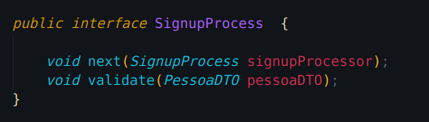
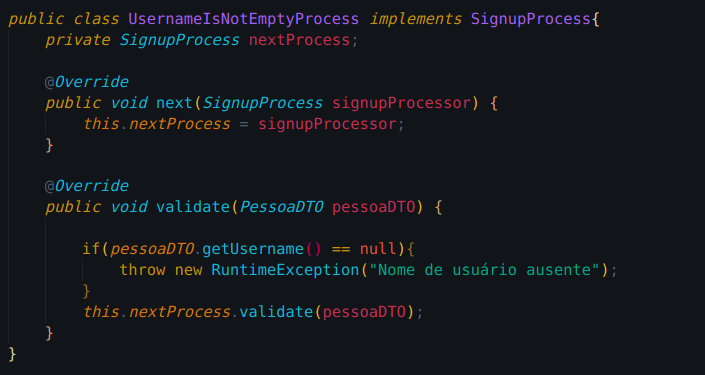
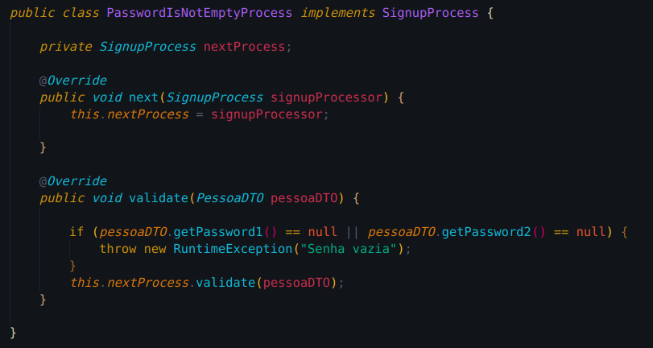
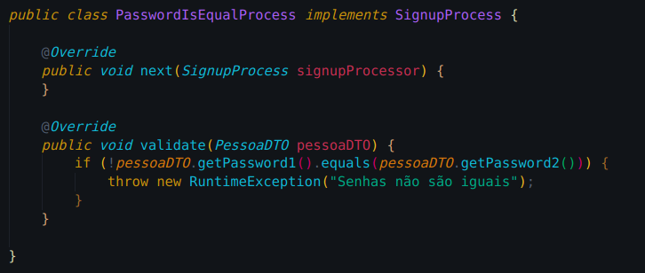

# 
 Chain of Responsability
 
    
### Histórico de versão 

|Data | Versão | Descrição | Autor(es)|
| -- | -- | -- | -- |
| 07.04.2021 | 0.1 | Criação do documento | Rafaella Junqueira Lucas Lopes Geraldo Victor Kalebe Lopes|
| 07.04.2021 | 0.2 | Adicao do diagrama UML | Rafaella Junqueira Geraldo Victor |

### Participantes

* Rafaella Junqueira
* Lucas Lopes
* Geraldo Victor
* Kalebe Lopes

### Introdução

O Chain of Responsibility, ou cadeia de responsabilidades, é um padrão de projeto comportamental que se baseia em transformar certos comportamentos em objetos solitários chamados handlers. Este padrão permite a passagem de pedidos por uma corrente desses handlers. Ao receber um pedido, cada handler decide se o processa ou o passa adiante para o próximo handler na corrente.

Nesta cadeia de responsabilidades, a principal função é evitar a dependência entre um objeto receptor e um objeto solicitante, por isso está ligado a ideia de baixo acoplamento, por permitir que outros objetos da cadeia tenham a oportunidade de tratar uma solicitação. A utilização do padrão permite determinar quem será o objeto que irá tratar a requisição durante a execução.

### Metodologia

A documentação do padrão GoF Chain of Responsability, assim como a modelagem do diagrama UML, foi realizada por meio de reuniões da equipe através da plataforma Discord. O diagrama foi modelado utilizando a ferramenta <a href="https://www.lucidchart.com/">Lucidchart.</a>

### Aplicação no projeto

O padrão pode ser aplicado para validar os dados de realização de cadastro de usuários. A abstração da cadeia é representada pela interface SigupProcess, os processos são definidos pelas classes PasswordIsNotEmptyProcess, UsernameIsNotEmptyProcess e PasswordIsEqualProcess. A classe Client contém a chamada à cadeia de processos.

[

](../../img/padroes/chain-interface.png)
<figcaption align='center'>
    <b>Figura 1 - Abstração da cadeia de responsabilidades </b>
</figcaption>
 

[

](../../img/padroes/chain-processo-1.png)
<figcaption align='center'>
    <b>Figura 2 - Representação de processos da cadeia </b>
</figcaption>
 

[

](../../img/padroes/chain-processo-2.png)
<figcaption align='center'>
    <b>Figura 3 - Representação de processos da cadeia</b>
</figcaption>
 

[

](../../img/padroes/chain-processo-3.png)
<figcaption align='center'>
    <b>Figura 4 - Representação de processos da cadeia</b>
</figcaption>
 

[

](../../img/padroes/chain-client.png)
<figcaption align='center'>
    <b>Figura 5 - Implementaçao do Cliente na cadeia de responsabilidade </b>
</figcaption>
 

### Modelagem UML

[

](../../img/padroes/uml-chain.png)
<figcaption align='center'>
    <b>Figura 6 - Diagrama UML da cadeia de responsabilidade</b>
     
    <small>Autores: Rafaella Junqueira e Geraldo Victor</small>
</figcaption>
 

## Referências
 
REFACTORING GURU, **Chain of Responsibility**, Disponível em [https://refactoring.guru/pt-br/design-patterns/chain-of-responsibility](https://refactoring.guru/pt-br/design-patterns/chain-of-responsibility) Acesso em 7 de abril de 2021.

WIKIPEDIA, **Chain of Responsibility** Disponível em [https://pt.wikipedia.org/wiki/Chain_of_Responsibility#Situa%C3%A7%C3%B5es_de_Uso](https://pt.wikipedia.org/wiki/Chain_of_Responsibility#Situa%C3%A7%C3%B5es_de_Uso) Acesso em 7 de abril de 2021.