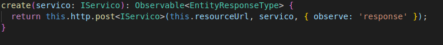

# 
 GoF Observer
 
    
### Histórico de versão 

|Data | Versão | Descrição | Autor(es)|
| -- | -- | -- | -- |
| 07.04.2021 | 0.1 | Criação do documento | Bruna Almeida Damarcones Porto Isabella Carneiro Lucas Lopes|
| 08.04.2021 | 1.0 | Adição da aplicação no projeto e diagrama UML | Bruna Almeida Damarcones Porto|

### Participantes

* Bruna Almeida
* Damarcones Porto
* Isabella Carneiro
* Lucas Lopes

### Introdução

O Observer é um padrão de projeto comportamental que permite que se defina um mecanismo de assinatura para notificar múltiplos objetos sobre quaisquer eventos que aconteçam com o objeto que eles estão observando. O padrão Observer representa uma relação de 1-N (de um para muitos) entre objetos. Assim quando um objeto altera o seu estado os objetos dependentes serão notificados/informados/avisados e atualizados de forma automática.
  

Esse padrão pode ser usado quando uma modificação do estado de um objeto implica modificações em outros objetos; quando um objeto deve ser capaz de notificar outros objetos, mas sem pressupostos sobre os objetos a serem notificados; ou quando uma abstração possuir dois aspectos e um depende do outro.
  

Uma das vantagens de se usar o Observer é que ele permite um acoplamento mínimo entre o Sujeito (Subjet) e o Observador (Observer). Outra vantagem oferecida por este padrão é poder reutilizar Sujeitos sem reutilizar os seus observadores e vice-versa.

 

### Metodologia

A documentação e modelagem do padrão Observer foi desenvolvida a partir de uma reunião com alguns integrantes, na plataforma Discord. Além disso, o diagrama UML foi desenvolvido pelos integrantes através da plataforma <a href="https://app.diagrams.net/">Draw.io</a>.

 

### Aplicação no projeto

O projeto utiliza este padrão principalmente na criação, edição e exclusão de serviços. Nos exemplos a seguir estão implementadas as classes ServicoService e ServicosComponent, que estão se comunicando para efetuar a manipulação dos serviços.

  

[

](../../img/padroes/gofs/observer-1.png)
<figcaption align="center">
    <b>Figura 1 - Representação da classe ServicoService.</b>
</figcaption>
 

[

](../../img/padroes/gofs/observer-3.png)
<figcaption align="center">
    <b>Figura 2 - Representação da classe ServicosComponent.</b>
</figcaption>
 

### Modelagem UML

O diagrama UML representa a forma como o padrão está sendo empregado no projeto, exemplificando o uso entre as classes ServicosComponent e ServicoService. 

  

[

](../../img/padroes/gofs/uml-observer.jpg)
<figcaption align="center">
    <b>Figura 3 - Representação UML das classes ServicosComponent e ServicoService</b>
</figcaption>
 

### Referências

DEVMEDIA, **Padrão de Projeto Observer em Java**. Disponível em: [devmedia.com.br/padrao-de-projeto-observer-em-java/26163](https://www.devmedia.com.br/padrao-de-projeto-observer-em-java/26163). Acesso em 7 de abril de 2021.

REFACTORING, **Observer**. Disponível em: [refactoring.guru/pt-br/design-patterns/observer](https://refactoring.guru/pt-br/design-patterns/observer). Acesso em 7 de abril de 2021.

MEDIUM, **Implementando Padrão de Projeto Observer no Java**. Disponível em: [medium.com/@FernandoUnix/implementando-padr%C3%A3o-de-projeto-observer-no-java-78ebb79b832b](https://medium.com/@FernandoUnix/implementando-padr%C3%A3o-de-projeto-observer-no-java-78ebb79b832b). Acesso em 7 de abril de 2021.

ANDRÉ CELESTINO, **[Delphi] Design Patterns GoF – Observer**. Disponível em: [andrecelestino.com/delphi-design-patterns-observer/](http://www.andrecelestino.com/delphi-design-patterns-observer/). Acesso em 7 de abril de 2021.

MACORATTI, **O padrão de projeto Observer**. Disponível em: [macoratti.net/13/03/net_obs1.htm](http://www.macoratti.net/13/03/net_obs1.htm). Acesso em 7 de abril de 2021.