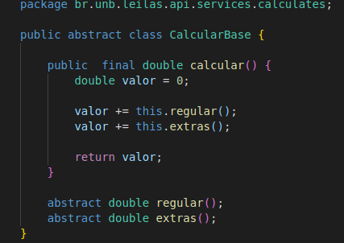

# 
 GoF Template Method
 
    
### Histórico de versão 

|Data | Versão | Descrição | Autor(es)|
| -- | -- | -- | -- |
| 08.04.2021 | 0.1 | Criação do documento | Bruna Almeida Damarcones Porto Isabella Carneiro Lucas Lopes|
| 08.04.2021 | 1.0 | Adição do diagrama UML | Bruna Almeida Damarcones Porto Isabella Carneiro   Lucas Lopes|

### Participantes

* Bruna Almeida
* Damarcones Porto
* Isabella Carneiro
* Lucas Lopes

### Introdução

 O Template Method é um padrão de projeto comportamental que define o esqueleto de um algoritmo na superclasse, mas deixa as subclasses sobrescreverem etapas específicas do algoritmo sem modificar sua estrutura. 

 Esse padrão estabelece os passos de um algoritmo e permite que a implementação de um ou mais desses passos seja fornecida por subclasses. Assim, o Template Method protege o algoritmo e fornece métodos abstratos para que as subclasses possam implementá-los. 

 

### Metodologia

A documentação e modelagem do padrão Template Method foi desenvolvida a partir de uma reunião com alguns integrantes, na plataforma Discord. Além disso, o diagrama UML foi desenvolvido pelos integrantes através da plataforma <a href="https://app.diagrams.net/">Draw.io</a>.

 

### Aplicação no projeto

O padrão Template Method está sendo utilizado no projeto para calcular o valor dos serviços prestados pelo Salão de Beleza. As figuras 1 e 2 exibem as Classes CalcularBase e CalcularServicos, esta última implementando os métodos abstratos da classe CalcularBase.

 

[

](../../img/padroes/gofs/method-2.png)
<figcaption align="center">
    <b>Figura 1 - Representação da classe CalcularBase.</b>
</figcaption>
 

[

](../../img/padroes/gofs/method-1.png)
<figcaption align="center">
    <b>Figura 2 - Representação da classe CalcularServicos.</b>
</figcaption>
 

### Modelagem UML

 O diagrama UML representa a forma como o padrão está sendo empregado no projeto, demonstrando como a classe CalcularServicos implementa os métodos abstratos da classe CalcularBase.

  

[

](../../img/padroes/gofs/uml-method.png)
<figcaption align="center">
    <b>Figura 3 - Representação UML das classes CalcularBase e CalcularServicos.</b>
</figcaption>
 

### Referências

DEVMEDIA, **Padrão de Projeto Template Method em Java**. Disponível em: [https://www.devmedia.com.br/padrao-de-projeto-template-method-em-java/26656](https://www.devmedia.com.br/padrao-de-projeto-template-method-em-java/26656). Acesso em 6 de abril de 2021.

REFACTORING, **Template Method**. Disponível em: [https://refactoring.guru/pt-br/design-patterns/template-method](https://refactoring.guru/pt-br/design-patterns/template-method). Acesso em 6 de abril de 2021.